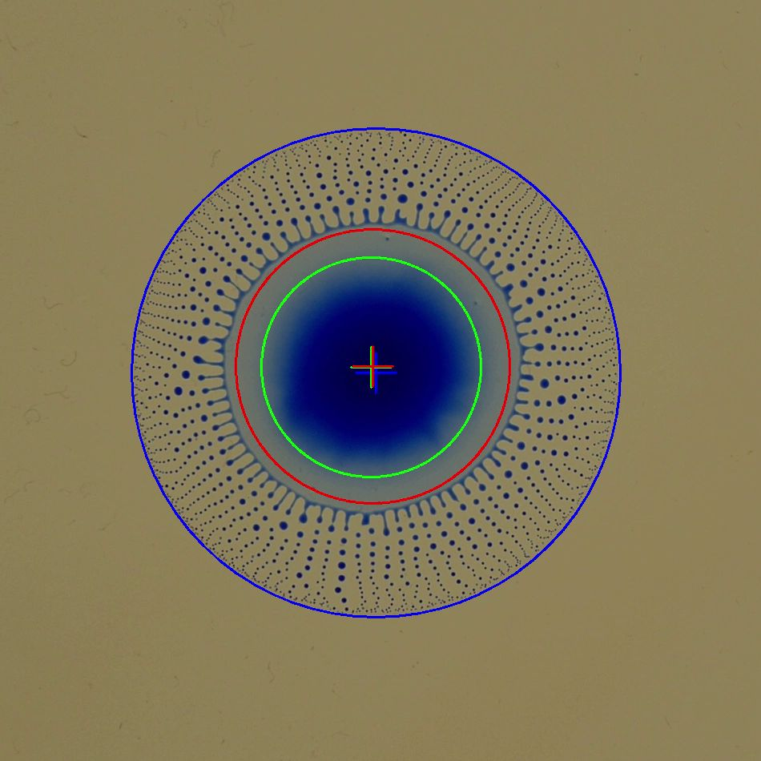
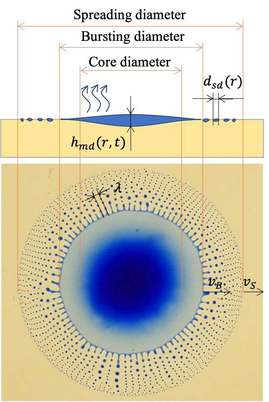
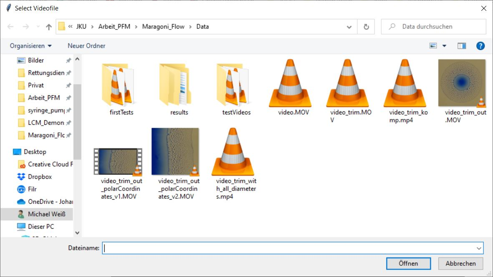

# Marangoni_flow_analysis
Data extraction and flow visualization for the marangoni flow project by **Stefan Puttinger** and **Mahdi Saeedipour**. The code was developed and released by **Michael Weiß**


# Description
The current release could extract the diameters of a droplet as shown in the table below. The scripts also provides a video Handler for dealing with video and extraction of data:

<table>
  <tr>
    <th>Acquired frame</th>
    <th>Processed frame</th>
    <th>Abstract</th>
  </tr>
  <tr>
    <td>
        
    </td>
    <td>
        
    </td>
    <td>
        
    </td>
  </tr>
</table>

One single frame can be described by the following parameters, which are explanied by the abstract of **Stefan** and **Mahdi**

* Center of droplet $c_x$ and $c_y$
* Diameters/Radius
    + Spreading diameter/radius $r_s$
    + Bursting diamters/radius $r_b$
    + Core diameter/radius $r_c$
* Fingerlength $\lambda$
* Droplet distribution $d_{sd}(r)$

For explanation see the abstract of **Stefan** and **Mahdi**


# How to use the scripts?
## Functions
The folder _maragoniProcessing_ contains the following scripts:
+ videoHandling.py
+ dataExtraction.py

## Import
To import the scripts the following line needs to be imported on top of your main file. To call a specific function write first scriptname followed by the function name.
```python
from maragoniProcessing import *
video = videoHandling.videoHandler()
```
In the code snippet the module ist loaded and a videoHandler class from the videoHandling.py file is instantiated.

## Video Handling
Calling the videoHandler class a filedialog is opened. By selection of the expirement the video variable is created


The variable has some specific functions:
```python
# get the frame at Index=100
frame = video.getSingleImage(frameNumber=100)

# iterate over the frames
for frame in video:
    print(frame)

# transformation function -> Example OTSU
def otsu(frame):
    gray = cv2.cvtColor(frame, cv2.COLOR_BGR2GRAY)
    th,otsu = cv2.threshold(gray,0,255,cv2.THRESH_BINARY_INV+cv2.THRESH_OTSU)
    img = cv2.cvtColor(otsu, cv2.COLOR_GRAY2RGB)
    return img

# creates an output video by a user defined function
video.creatOutputVideo(fcn=otsu, vidDim=None)    
```
The _video.createOutputVideo_ can also take video dimension for cropping options. The function itself is a pipeline system shown in the flow chart


## Data Extraction
The function centerAndAllDiameters() from the dataExtraction.py script returns the parameters $c_y$, $c_y$, $r_c$, $r_b$, $r_s$ as a tuple. They can afterwards be extracted as a csv file
```python
for img in video:
    print(dataExtraction.centerAndAllDiameters(frame=img))
```
