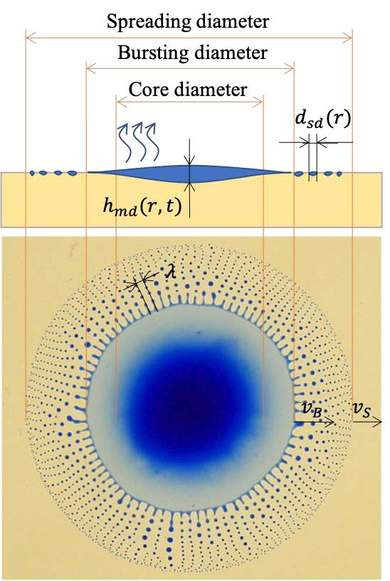

# Marangoni_flow_analysis
Flow visualization and analysis of marangoni flow

## Description
The implemented functions take a aquired video sequence and extracts the diameters/radius as separate video or .csv file

## Functions
